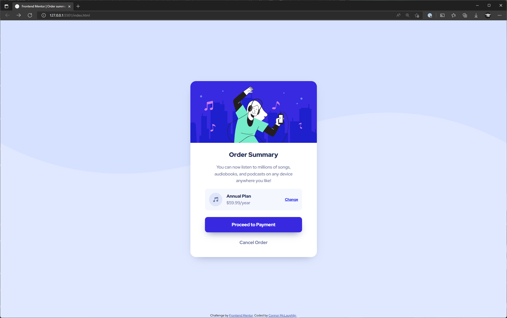
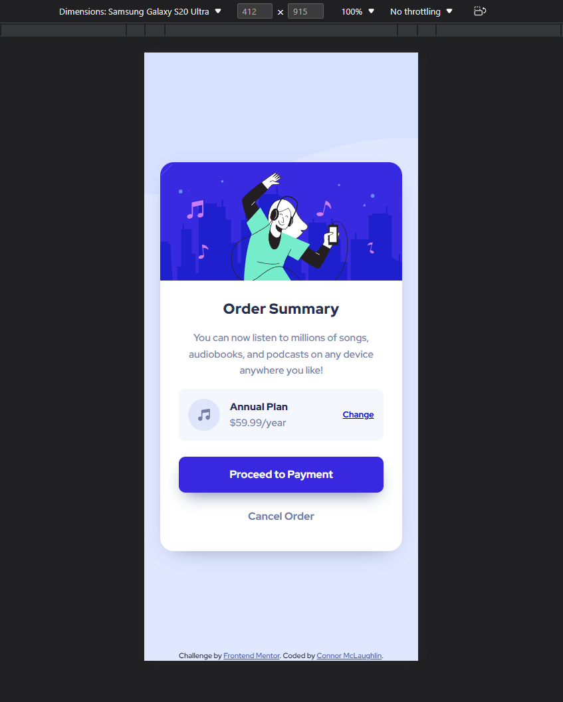

# Frontend Mentor - Order summary card solution

This is a solution to the [Order summary card challenge on Frontend Mentor](https://www.frontendmentor.io/challenges/order-summary-component-QlPmajDUj). Frontend Mentor challenges help you improve your coding skills by building realistic projects.

## Table of contents

-   [Overview](#overview)
    -   [The challenge](#the-challenge)
    -   [Screenshot](#screenshot)
    -   [Links](#links)
-   [My process](#my-process)
    -   [Built with](#built-with)
-   [Author](#author)

## Overview

### The challenge

Users should be able to:

-   See hover states for interactive elements

### Screenshot

-   Desktop
    
-   Mobile
    

### Links

-   Solution URL: [Frontend Mentor Submission](https://www.frontendmentor.io/solutions/order-summary-component-using-flexbox-and-scss-6Yjq9CFvCJ)
-   Live Site URL: [GitHub Live Page](https://cbmclaughlin.github.io/FM-OrderSummary/)

## My process

### Built with

-   Semantic HTML5 markup
-   CSS custom properties
-   Flexbox
-   Mobile-first workflow

## Author

-   Frontend Mentor - [@CBMcLaughlin](https://www.frontendmentor.io/profile/CBMcLaughlin)
-   LinkedIn - [Connor McLaughlin](https://www.linkedin.com/in/connor-mclaughlin-3b89a4183/)
